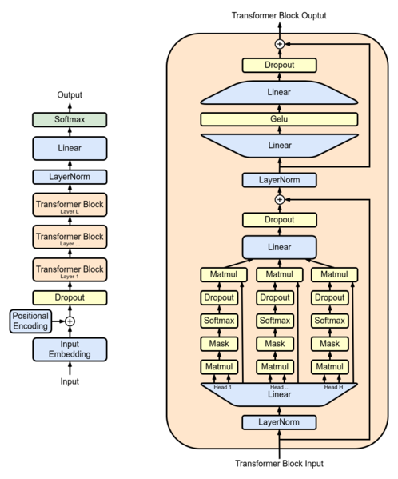

# Educational Transformer

This Python project is an easy-to-follow, educational implementation of the transformer model in PyTorch. Since training takes just seconds (1.7sec on M1 MacBook), it encourages learning, experimentation, and playing with parameters. The [model.py](src/model.py) file is 110 code lines mixed with 50 comment lines, like in the example below:

```python
    ...
    def forward(self, x):
        # Get batch size, sequence length, and embedding size.
        B, T, C = x.shape
        # Expand embeddings 3X, because each head will need query, key, and value.
        x = self.in_linear(x)
        # Split heads (B, T, n_head, 3*C//n_head), transpose to (B, n_head, T, 3*C//n_head).
        x = x.reshape(B, T, self.n_head, -1).transpose(1, 2)
        ...
```

This transformer implementation is simpler because:
* There is no tokenizer step, instead generated data is directly fed to the model. 
* There is no support for loading pretrained GPT2 or similar model wights.
* It doesn't try to reproduce results from any paper.
* There is no support for distributed training (multiple GPUs).

Below is the diagram of the implemented decoder-only, auto-regressive transformer architecture ([GPT-2](https://en.wikipedia.org/wiki/GPT-2)):


## Influence and Rationale
I wanted to learn transformer architecture by recreating a minimum project. I was first recommended [nanoGPT](https://github.com/karpathy/nanoGPT/), a great project but a bit too complex for beginners. That is because nanoGPT is compatible with published GPT models, tries to reproduce benchmarks, and supports distributed training.

Fortunately, Karpathy's previous [minGPT](https://github.com/karpathy/minGPT/) project is simpler and more educational. I used minGPT as a basis for this project but added comments and changed the structure to make it easier to follow.

## Installation

The dependencies are NumPy and PyTorch. Since they are listed in [setup.py](setup.py), you can install them by running this in the root folder:

```bash
pip install .
```

## Usage

To start, open the root folder in VSCode, and open [main.py](main.py), which contains the code to train and evaluate the model. It uses [VSCode code cells](https://code.visualstudio.com/docs/python/jupyter-support-py), similar to Jupyter ```*.ipynb notebooks```. However, VSCode code cells have a few advantages:

* Code cells are in normal ```*.py``` files that you can run directly.
* Code cells can be run interactively by using ```Run Cell|Run Below/Above|Debug Cell``` above cells.
* Unlike Jupyter notebooks, cell outputs are in a separate Interactive window. The "notebook" state is deleted when window is closed.

Another code cells file is [param_search.py](param_search.py), which searches for the best hyperparameters for this toy model.

## Project Structure

The project consists of the following files:

* [main.py](main.py) and [param_search.py](param_search.py) - tutorial code cells files as explained above.
* [src/](src/) folder contains dataset, model, and helper methods:
    * [src/dataset.py](src/dataset.py) - Generates a toy dataset that sorts numbers (e.g. [2, 0, 1, 2, 2, 2] to [0, 1, 2, 2, 2, 2]).
    * [src/model.py](src/model.py) - Decoder-only, auto-regressive transformer model.
    * [src/pytorch_utils.py](src/pytorch_utils.py) - Helpers for PyTorch projects.
    * [src/train_eval.py](src/train_eval.py) - Trainer and evaluator specific to this dataset and model.
* [param-calc.xlsx](param-calc.xlsx) - Spreadsheet that calculates number of parameters in a model.
* [Wiki-Full-GPT-architecture.png](Wiki-Full-GPT-architecture.png) - Wikipedia image of GPT-2 transformer architecture.
* [readme.md](readme.md) - This file.
* [LICENSE](LICENSE) - MIT license.
* [setup.py](setup.py) - Metadata and requirements.

## License

This project is licensed under the [MIT License](LICENSE).
